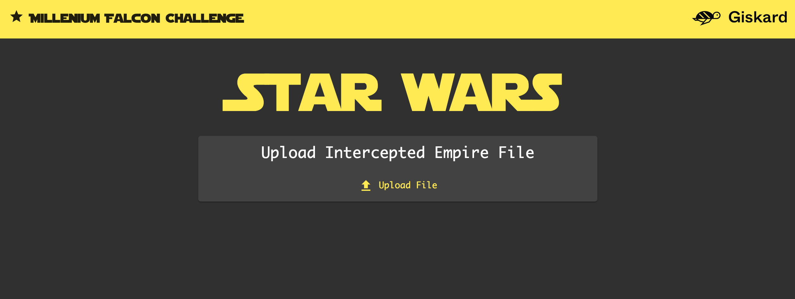
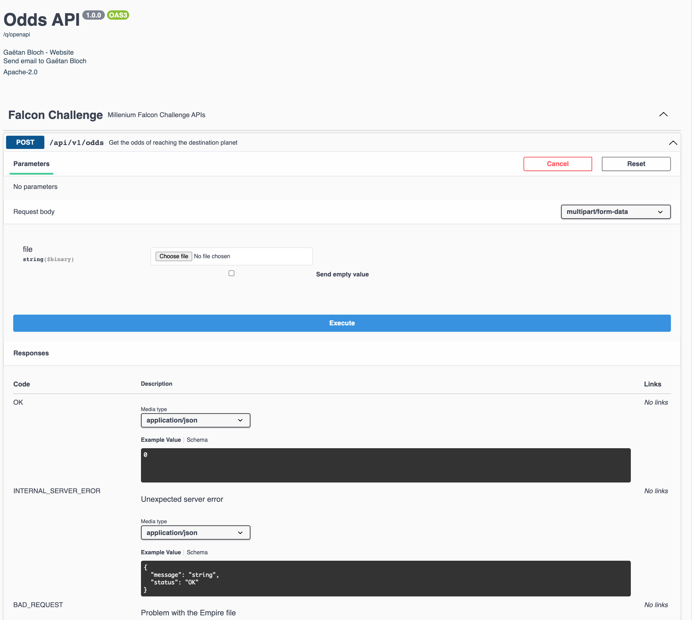

[](https://github.com/gaetanBloch/falcon-challenge/actions)
[](https://codecov.io/gh/gaetanBloch/falcon-challenge)

# Millenium Falcon Challenge

## What are the odds?

The Death Star - the Empire's ultimate weapon - is almost operational and is currently approaching the Endor planet. The countdown has started.

Han Solo, Chewbacca, Leia and C3PO are currently on Tatooine boarding on the Millennium Falcon. They must reach Endor to join the Rebel fleet and destroy the Death Star before it annihilates the planet.

The Empire has hired the best bounty hunters in the galaxy to capture the Millennium Falcon and stop it from joining the rebel fleet...

## Application

The goal of the application is to compute and display the odds that the Millennium Falcon reaches Endor in time and saves the galaxy.


The web application will be composed of a backend (the Millennium Falcon onboard computer), a front-end and a CLI (command-line interface).

### Prerequisites

- Install [Java 17+](https://jdk.java.net/archive/)
- Download latest release of the project : [v0.1.0](https://github.com/gaetanBloch/falcon-challenge/releases/download/v0.1.0/falcon-chalenge-0.1.0.tar.gz)
- Untar the project `tar -xzf falcon-chalenge-0.1.0.tar.gz`

### Web Application

To run the web application:

```sh
cd falcon-chalenge-0.1.0/web
./falcon-chalenge-0.1.0.sh
```

To run the web application in a docker container from the Github container registry:

```sh
docker pull ghcr.io/gaetanbloch/falconchallenge:latest
docker run -i --rm -p 8080:8080 ghcr.io/gaetanbloch/falconchallenge:latest
```

To run the web application in a docker container after building the image locally:

```sh
git clone https://github.com/gaetanBloch/falcon-challenge.git
cd falcon-challenge
./run-web-container.sh
```

Open your browser on [http://localhost:8080](http://localhost:8080), you should have a web page looking like this:



You can also access to the swagger documentation page on [swagger-ui](http://localhost:8080/q/swagger-ui), you should have a web page looking like this:



### CLI Application

To run the cli application:

```sh
cd falcon-challenge-0.1.0/cli
./give-me-the-odds.sh <falconConfigFile> <empireFile>
```

You can see the usage of the commande by typing:

```sh
./give-me-the-odds.sh --help
Usage: give-me-the-odds [-hV] <falconConfigFilePath> <empireFilePath>
Get the odds of reaching the destination planet
      <falconConfigFilePath>
                         The abslute or relative path to the Millenium Falcon's
                           config file
      <empireFilePath>   The absolute or relative path to the Intercepted
                           Empire file
  -h, --help             Show this help message and exit.
  -V, --version          Print version information and exit.
```

## Repository

To build the project without tests:

```sh
git clone https://github.com/gaetanBloch/falcon-challenge.git
cd falcon-challenge
./mvnw clean package -DskipTests
```

To run the tests of the project:

```sh
git clone https://github.com/gaetanBloch/falcon-challenge.git
cd falcon-challenge
./mvnw clean test
```

To run the project in dev mode:

```sh
git clone https://github.com/gaetanBloch/falcon-challenge.git
cd falcon-challenge
./mvnw
```

To change the *millenium-falcon.json* and execute the web application:

```sh
git clone https://github.com/gaetanBloch/falcon-challenge.git
cd falcon-challenge
vim web/src/main/resources/millenium-falcon.json
./mvnw clean package
java -jar web/target/falcon-challenge-0.1.1-SNAPSHOT-runner.jar
```
